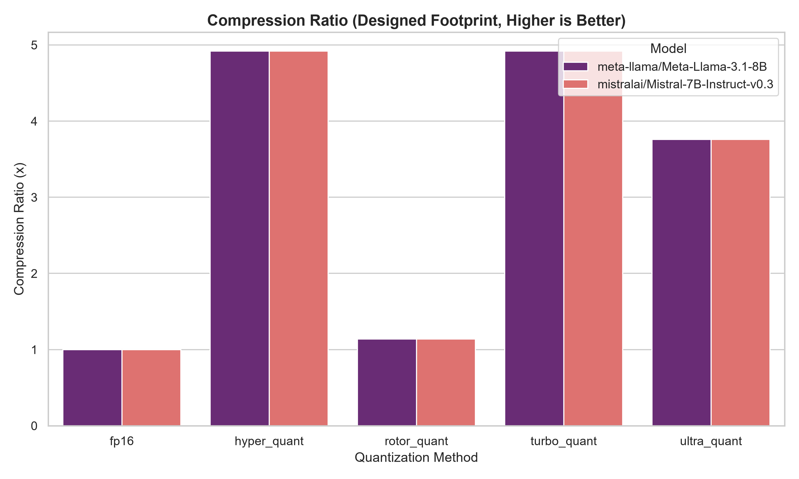
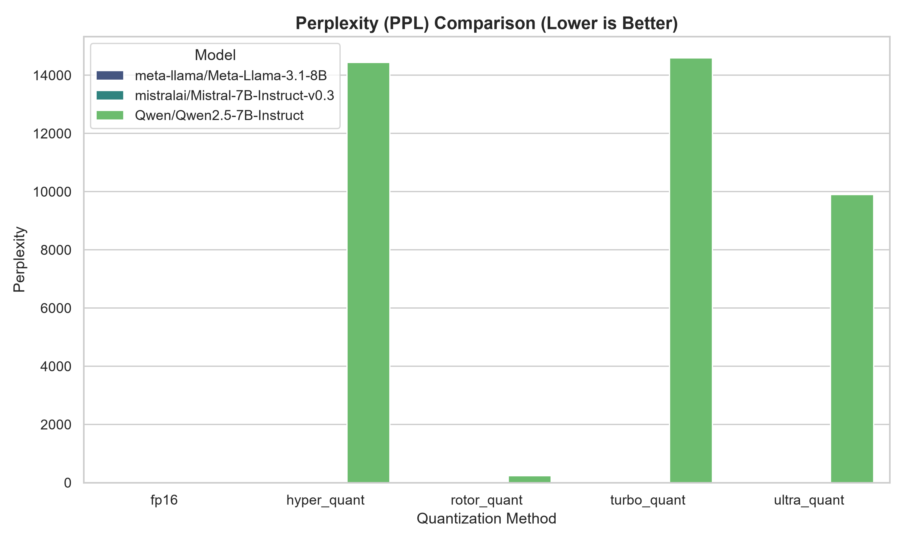
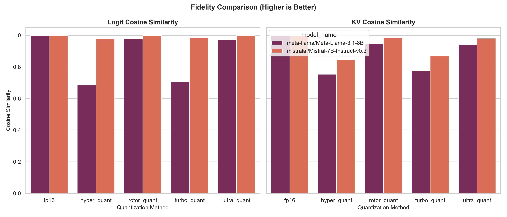
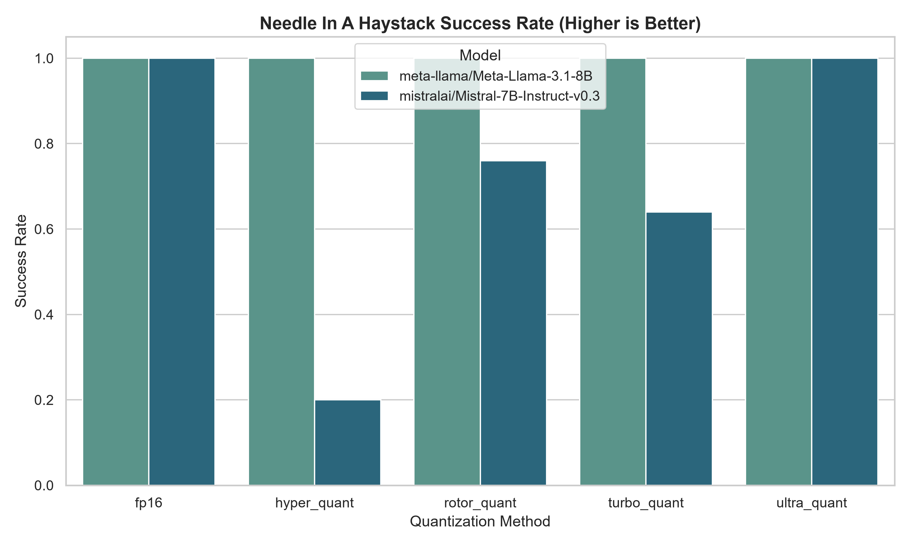
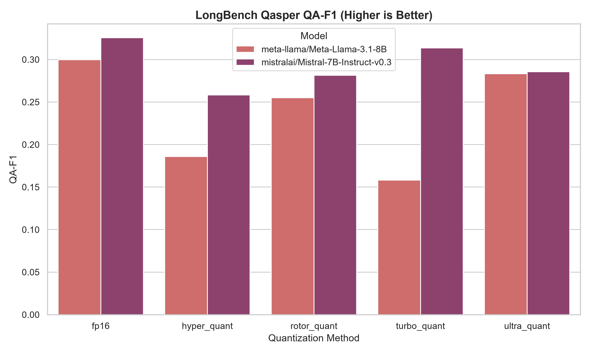
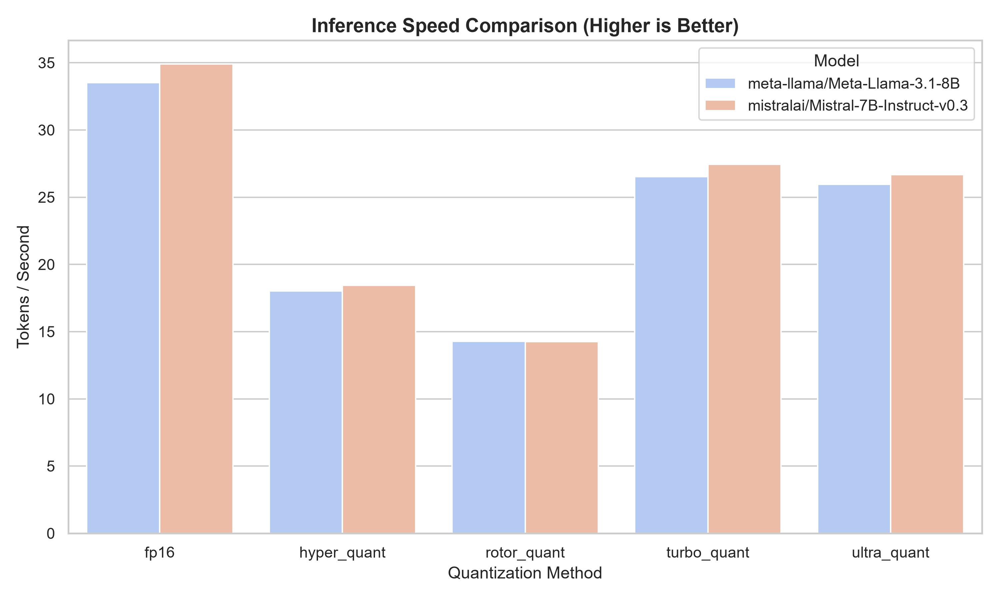

# kvq-bench 🚀

[](https://opensource.org/licenses/MIT)
[](https://en.cppreference.com/w/cpp/17)

[English](README.md) | **日本語**

大規模言語モデル（LLM）の **KVキャッシュ量子化技術** を比較するためのベンチマークフレームワークです。

**TurboQuant**・**RotorQuant**・**HyperQuant**・**UltraQuant** の4手法に着想を得た **簡易PyTorch再実装** と、スタンドアロンのC++マイクロベンチマークを含みます。

> ⚠️ **適用範囲の注意**：本リポジトリのアルゴリズムは*簡易再実装*であり、論文の忠実な再現ではありません（[Scope & Limitations](#-scope--limitations-適用範囲と限界)参照）。Related Work の数値は**各論文のもの**で、本リポジトリの実験結果ではありません。

---

## 🌟 比較対象の手法（簡易再実装）

| 手法 | 論文のアイデア | 本実装の範囲 | 論文のビット幅 | 本実装の `designed_bits` |
| :--- | :--- | :--- | :---: | :---: |
| **TurboQuant** | 極座標分解＋QJL | ランダム直交回転＋per-token abs-max 一様量子化 | 3-bit / 8-bit | 3.0 |
| **RotorQuant** | Clifford代数ロータ | Cl(3,0) の3Dブロック回転＋3Dブロック毎スケール（ロータはランダム固定・キャリブレーション無し） | 3-bit / 8-bit | 3.0 |
| **HyperQuant** | RHT＋格子量子化＋Rice符号化 | 直交Hadamard＋**D4格子射影**（Rice符号化は未実装） | 1.7〜2 bps | 3.0 |
| **UltraQuant** | FP4ハードウェア直結デコード | Walsh-Hadamard＋FP4(E2M1)グリッド、per-tokenスケール | 4-bit | 4.0 |

`designed_bits` は各実装の量子化レベル数から**自動導出**した論理ビット幅です（手書き定数ではない）。エントロピー符号化が無い限り bps としての 4bit 未満の主張はできないため、HyperQuant 論文のような 1.7〜2 bps は本実装では達成し得ません（3 bit/scalar）。

---

## 🔭 Scope & Limitations（適用範囲と限界）

このベンチマークが**主張できること**（2026-08 修正後）:

- **機能評価（シミュレーション量子化としての品質評価）**：quantize→dequantize を設計通りに適用し、PPL・logit/KV忠実度・NIAH成功率・LongBench QA-F1 などの品質指標で実装の精度劣化を測る。
- **量子化処理自体のオーバーヘッド**：fp16 attention に対して量子化器が乗せる追加コストの測定。

**主張できないこと**（設計上の制約）:

- **量子化によるデコード高速化**：attention は常にデコードされた高精度テンソルで実行され、fused kernel が無いためメモリ帯域削減の恩恵は受けない。速度数値はオーバーヘッド測定に過ぎない。
- **実測での設計ビット相当のメモリ削減**：保存形式は int8（パッキング無し）のため実占有は designed_bits を反映しない。メモリは**解析的 footprint**（設計ビットのデータ＋実装メタデータのモデル化）として報告する。
- **論文の忠実な再現**：PolarQuant/QJL（TurboQuant）、ロータ最適化（RotorQuant）、Rice符号化（HyperQuant）、UE8M0ブロックスケール・MFMA直結（UltraQuant）は未実装。
- **RoPE前量子化（KIVI系）**：本キャッシュは post-RoPE の K を受け取る。RoPE前スキームはモデル改造が必要で枠組み外。
- **統計的に強い主張**：サンプル数は小規模。結果は傾向の観察として扱う。

---

## 📚 Related Work（論文の数値です。本リポジトリの実験結果ではありません）

### TurboQuant（Google Research、ICLR 2026）
2段階の圧縮を行う手法です：
- **PolarQuant**：ベクトルをデカルト座標から極座標に変換し、半径（大きさ）と角度（方向）に分離。角度分布が予測可能なため、従来必要だったブロック単位の正規化をスキップ可能。
- **QJL補正**：Johnson-Lindenstrauss変換で高次元データを縮小しつつ距離関係を保持し、各値を1ビットの符号（+1/-1）に削減。

| 指標 | 値 |
| :--- | :--- |
| 圧縮率 | 3ビットで6倍メモリ削減 |
| 速度向上 | Attention計算が最大8倍高速（H100） |
| 精度劣化 | ゼロ（LongBench, RULER等で検証済み） |
| 検証モデル | Gemma, Mistral |

**独立検証**：vLLMチームによる包括的な第三者検証（2026年5月）では、本番規模のモデル（Llama-3.3-70B-Instruct、Qwen3-30B-A3B、MiniMax-M2.7）を対象に、長文検索（MRCR）と推論系ベンチマーク（AIME25, GPQA, MATH500, LiveCodeBench-v6）で評価が行われました。結果は原論文よりも複雑で、FP8 KVキャッシュ量子化がBF16と同等のスループットのまま2倍の容量を確保し精度劣化もほぼ無しだった一方、TurboQuantの`k8v4`バリアントはFP8に対してわずかな優位性しかなく、スループットは40〜52%低下しました。`4bit-nc`バリアントはメモリ逼迫時に有用な、最も実用的なTurboQuant構成と評価された一方、より積極的な`k3v4-nc`／`3bit-nc`バリアントは難易度の高い推論・コーディングタスクで最大約20ポイントの精度低下が見られ、本番環境ではFP8 KVキャッシュが推奨されるデフォルトとされました。

参考文献：[arXiv:2504.19874](https://arxiv.org/abs/2504.19874)

### RotorQuant（Scrya）
TurboQuantのコアアルゴリズムをClifford代数（幾何代数）のロータで再設計した手法です。TurboQuantが用いるd×dのランダム直交回転行列（d=128で16,384回の乗算加算）を、Clifford代数 Cl(3,0) のロータ $R = \exp(B/2)$ に置き換えます。ベクトルを3次元グループに分割し、各グループに4パラメータのロータでサンドイッチ積 $RvR̃$ を適用します。

- 乗算加算：16,384 → 約2,064回（7.9倍削減、RotorQuant論文Table 1より）
- パラメータ数：16,399 → 372（44倍削減、RotorQuant論文Table 1より）

| 指標 | 値 |
| :--- | :--- |
| Perplexity（WikiText-2、Llama 3.1 8B Instruct、10.3倍圧縮時） | `iso3`: 6.91 vs TurboQuant `turbo3`: 7.07 — 同じ圧縮率でより高品質 |
| デコード速度 vs TurboQuant | 28%高速（119 vs 93 tok/s、RTX 5090） |
| プレフィル速度 vs TurboQuant | 5.3倍高速（3,822 vs 722 tok/s、RTX 5090） |
| パラメータ数 | 44倍少ない（372 vs 16,399、RotorQuant論文Table 1より） |
| 検証モデル | Llama 3.1 8B Instruct（主要ベンチマーク）、Qwen2.5-3B（デコード速度およびPython/TritonでのPerplexityベンチマーク）、MiniMax-M2.7（アーキテクチャ互換性チェックのみ、フルベンチマークではない） |

**重要な補足**：上記の「TurboQuantを上回る」という主要な結果は、実はRotorQuant本体（Clifford代数）ではなく、同じブロック対角回転のアイデアに基づく2つの派生手法——**IsoQuant**（4次元クォータニオン回転）と**PlanarQuant**（2次元ギブンス回転）——によるものです。この2つは別の貢献者（ParaMind2025）によって開発されました。リポジトリ自身が公開しているQwen2.5-3BでのPython/TritonによるPerplexity比較では、素のRotorQuant（3-bitでPPL 12.22、4-bitでPPL 10.03）はIsoQuant（4-bitでPPL 9.03）やPlanarQuant（3-bitでPPL 10.12）よりもむしろ性能が劣っています。リポジトリ内でもRotorQuant自体は「Research（Triton）」ステータス、IsoQuant/PlanarQuantは「Production（llama.cpp）」ステータスと明確に区別されています。以前記載していた「CUDA: 10-19倍、Metal: 9-31倍」という速度向上や、特定のコサイン類似度の数値については、現行のリポジトリの記載では確認できなかったため削除しました。

参考文献：[github.com/scrya-com/rotorquant](https://github.com/scrya-com/rotorquant)

### HyperQuant
TurboQuantのような「KVキャッシュ専用の局所的なテクニック」を包含・凌駕し、「モデルの重み（Weights）」と「KVキャッシュ」の両方を同時に圧縮する統一（Unified）量子化パイプラインです。レート・歪み理論（Rate-Distortion Theory）を突き詰め、1.7〜2 bps（ビット/パラメータ）という極小のビット数まで精度を落とさずに圧縮します。

- **格子（多次元）量子化**：各成分を独立して丸める「スカラー量子化」ではなく、2次元・4次元・8次元空間で点を隙間なく詰め込める幾何学構造（$A_2, D_4, E_8$格子）を採用。同じビット数でも量子化誤差が空間の性質として大きく小さくなります。
- **エントロピー符号化**：RHT（ランダム・アダマール変換）で分布をガウス分布に変換した後、格子の幾何学的制約を利用して余分なビットを落とし（Bit-stripping）、発生頻度の高い値に短いビットを割り当てる可変長のRice符号化を施します。理論上の限界値のわずか約0.01 bps手前という圧縮効率を実現。
- **適用範囲**：LLMの重みとKVキャッシュの両方、さらにText-to-Videoモデル（19BパラメータのLTX-2など）といったDiffusion Transformers（DiT）の圧縮にも適用可能です。

| 指標 | 値 |
| :--- | :--- |
| vs TurboQuant / OCTOPUS（KVキャッシュ） | 1.7 bps（ビット/スカラー）まで両手法を上回る |
| vs HIGGS（重み） | 3〜5 bpsのすべての動作点で上回る |
| 圧縮率（H100、4 bps、ほぼロスレス） | 重み約3.9倍、KVキャッシュ約3.79倍 |
| レート歪みの理論限界とのギャップ | 約0.01 bps以内 |
| 検証モデル | Llama-3.1-8B（KVキャッシュのみのパス、bf16重み）、LTX-2（19BパラメータのDiT動画モデル、フレーム単位のアーティファクトなし） |
| Tritonカーネル速度向上 | *公開されている論文本文中には記載なし* |

参考文献：[arXiv:2606.23406](https://arxiv.org/abs/2606.23406)

### UltraQuant: 4-bit KV Caching for Context-Heavy Agents
これまでの手法（TurboQuant、HyperQuant）が抱えていた「システム実装・ハードウェア実行におけるボトルネック」を極限まで解消するために開発された、システム・ハードウェア連携型の4-bit KVキャッシュ圧縮手法です。理論的に美しいアルゴリズムが持ち込むソフト処理（コードブック参照やQJL補正）の遅延を捨て、最新GPUのハードウェア機能（FP4/FP8命令）に完璧に適合させた実践派、という位置づけです。

TurboQuantは「4-bitで高精度」を達成した画期的なアルゴリズムですが、実際にGPU（vLLMなど）上で動かすとデコード速度（Time-To-First-Tokenなど）が低下する弱点がありました。原因は、精度を保つための「ルックアップテーブル（コードブック参照）」や「1-bit残差補正（QJL）」を復元する際のソフトウェアループ処理が重すぎたためです。UltraQuantは特に長文を扱い、対話が続くエージェント型ワークロード（Context-Heavy Agents）において、メモリ容量を削減しつつ実際の推論スループットも高速にすることを目的に開発されました。

- **Walsh-Hadamard回転**：TurboQuantと同様に、Keyベクトルの外れ値を回転行列によって均一なガウス分布に分散。
- **QJL（残差補正）の切り捨て**：ソフトでのデコードオーバーヘッドが大きすぎるためあえて排除。
- **ハードウェアネイティブなFP4 Micro-tensor（E2M1）形式**：独自コードブックの代わりに、最新GPUがハードウェアレベルでネイティブサポートするFP4（E2M1形式：1符号ビット、2指数ビット、1仮数ビット）のグリッド値に直接マッピング。
- **ブロック単位のスケーリング（UE8M0）**：32チャンネルごとに共通のスケール係数を持たせ、オフラインで最適化した単一の定数 $c = 0.156$（論文中のアブレーションでMSE最適であることが確認済み）を乗算するシンプルなスケーリングを採用。これによりルックアップテーブルのソフト解読を排除し、GPUの行列演算器（MFMA / Tensor Core命令）にFP4データを直接流し込んで演算できます。

| 指標 | 値 |
| :--- | :--- |
| ヘッドライン：TTFT vs FP8 KV（エージェント型ワークロード、後半ラウンド／全ラウンド） | 3.47倍高速 / 2.3倍高速 |
| ヘッドライン：出力スループット vs FP8 KV（エージェント型ワークロード） | 1.63倍 |
| BF16比スループット（標準的なサービング、並列度64） | 1.38倍（FP8 KVの1.37倍とほぼ同等・誤差1%以内）、かつFP8の半分のKVバイト数で実現 |
| BF16比の中央値TPOT（1トークンあたり出力時間） | 1.40倍（FP8 KV: 1.37倍、Ultra-TQ: 1.58倍、vLLM OSS TurboQuant: 5.56倍） |
| UE8M0スケーリング定数 | $c = 0.156$ — MSE最適であることを確認済み。論文のGPQAアブレーションではFP8ベースラインを+4.4ポイント上回る |
| ハードウェア | AMD Instinct MI355X（CDNA4）、TP=2、ネイティブscaled-MFMA命令 |
| 検証モデル | MiniMax-M2.5（スループット／レイテンシ計測）／Qwen3.5-A3B、MiniMax-M2.5、Qwen2.5-72Bを対象とした本番想定の精度マトリクス（GPQA-Diamond、LCB-128K、AIME25、MATH500） |
| 精度への影響（本番想定マトリクス） | MATH500では安定〜微増（+0.0〜+0.8ポイント）、GPQA-DiamondとLCB-128Kでは競争力あり。一方で**AIME25では顕著な精度低下**（Qwen3.5-A3Bで−13.3ポイント、MiniMax-M2.5で−10.0ポイント、Qwen2.5-72Bで−3.3ポイント）が見られ、著者ら自身が「一律にほぼロスレスというわけではなくベンチマーク依存」と明言している。全結果はBoundary-layer protection（最初と最後の各2つのAttentionレイヤーはBF16のまま保持）を適用した状態のもの |

参考文献：[arXiv:2606.20474](https://arxiv.org/abs/2606.20474)

---

## 🧪 実験方法

### 計算資源
| プラットフォーム | ベンダー |
| :--- | :--- |
| ai-l40s | NVIDIA（L40S） |

> **例外**：忠実度評価の再測定（Top-1 飽和修正後のもの）のみ、実行時点で ai-l40s が利用不可だったため **ai-h100l-pu（NVIDIA H100）** パーティションを使用しました（`hpc_scripts/run_rerun_fidelity_ai_h100l_pu_llama.sh` / `run_rerun_fidelity_ai_h100l_pu_mistral.sh` の2分割ジョブ。pu パーティションは最大実行時間30分のためモデルごとに分割）。量子化器の数値結果はデバイスに依存しないため結果への影響はありません。速度値はすべて ai-l40s での測定値であり、このジョブでは測定していません。

### 使用するLLM
- Meta-Llama 3.1 8B（`meta-llama/Meta-Llama-3.1-8B`）
- Mistral 7B v0.3（`mistralai/Mistral-7B-Instruct-v0.3`）

### 0. Sanity gate（回帰テスト） — `eval_pt/sanity_check.py`
評価の最初に実行し、失敗したら全体を中止します。

**共通プロトコル**：約256トークンの固定プロンプトから **greedy 16トークン** を生成します。`model.generate` は使わず、prefill → 1トークンずつの手動デコードループ（評価スクリプトと同じパス）で生成し、fp16 ベースラインとのトークン列の一致を見ます。モデル精度は他の評価と揃えて CUDA では bfloat16 です。

#### 全手法共通 — キャッシュ配管の検証（passthrough）
**passthrough**（量子化を行わない疑似量子化器）が fp16 と**トークン完全一致**することのみを `overall_pass` の判定対象とします → キャッシュ配管（蓄積・連結・全履歴返却）の正当性を量子化誤差から分離して検証。過去の decode キャッシュバグはこのテストで即検出できたはずのものです。

#### turbo_quant / rotor_quant / hyper_quant — 7bit 往復生成テスト
ビット数を連続可変にできる（精度ノブを持つ）3手法について、本番より高ビットの **7bit** で動かしたときの fp16 とのトークン一致率を報告します（基準：一致率 ≥ 0.5 を準ロスレスとみなす情報表示で、`overall_pass` には含めません）。「同じ往復経路のまま誤差だけ小さくできる」設計なので、7bit でほぼロスレスなら量子化往復の数式が健全と判断できます。

#### ultra_quant — 専用 sanity 実験（別経路）
ultra_quant は FP4 (E2M1) の **16点固定グリッドが手法の定義そのもの** で、「7bit相当」の高ビットモードが存在しないため 7bit ループの対象外です。代わりに専用スクリプト `eval_pt/sanity_check_ultra.py`（sbatch: `hpc_scripts/run_sanity_ultra_ai_l40s.sh`）で、以下の2検証を行います（既存コードは変更せず、スクリプト内の継承クラスで差し込む構成）：

1. **ロスレス分解テスト**（配管＋回転/スケールの数式検証）：FP4グリッドへの丸めのみを外した高精密バイパス版（WHT回転＋absmax/6スケール往復は本番と同一、格納は実質 fp32 相当）で fp16 とのトークン一致率 ≥ 0.9 を要求します（期待値は 1.0 前後。これを大きく外す場合は往復実装の破綻を疑う）。
2. **ネイティブ4bit グリッド健全性チェック**（モデル不要の数値検証）：seed 固定の乱数テンソルを本番そのままの 4bit モードで compress→decompress し、(a) 相対L2誤差 < 0.40、(b) 全量子化インデックスが 0〜15 の範囲内（int8 溢れ型バグの検出）であることを確認します。グリッドマッピング自体は生成テストではロスレス性を根拠に判定できないため、誤差上限を定数として検証します。

### 品質指標（機能評価 = シミュレーション量子化）
- **Perplexity**：WikiText-2、window 2048 / stride 512 → `eval_pt/eval_ppl.py`
- **Logit 忠実度**：最終 logits のコサイン類似度・Top-1一致率・Top-5**重なり率**（seq 1024、非反復の自然文を使用） → `eval_pt/eval_fidelity.py`
  - 注意：反復的な合成文を入力にすると、次トークン予測のマージンがほぼ全位置で大きくなり Top-1 が飽和して（例えば全条件で 1023/1024≈99.90% に張り付き）識別力を失います。旧実装はこの状態でしたが、非反復の自然文に修正し再測定済みです（下表）。
- **KV 忠実度**：キャッシュの K/V ベクトル自体のコサイン類似度・相対L2誤差（量子化誤差そのものを直接測定） → 同上
- **NIAH**：深度 {10/30/50/70/90%} × 各深度5試行（= 計25試行）の**成功率**（8Kコンテキスト、greedy 16トークン、鍵の完全一致） → `eval_pt/eval_niah.py`
- **LongBench**：正式 LongBench の **Qasper** QAタスク、先頭10サンプル、公式形式のトークンF1、左側6144トークン切り捨て → `eval_pt/eval_longbench.py`

### システム指標（主張の範囲を限定した扱い）
- **解析的 KV footprint**：各実装の `designed_bits` からデータ部を計算し、実装仕様のメタデータ（per-token / 3Dブロック毎の fp32 スケール等）を加算 → `eval_pt/theoretical_compression.py`（GPU不要）と `eval_pt/eval_compression.py`（保存占有の実測も併記）
- **速度**：prefill時間・decode tokens/sec、ウォームアップ後3回の中央値（8Kコンテキスト、32トークン生成）。**解釈は量子化オーバーヘッド込みの速度のみであり、高速化は主張しない** → `eval_pt/eval_speed.py`

---

## 📊 ベンチマーク指標（C++マイクロベンチマーク）

1. **エンコード＆デコードレイテンシ（µs）**：高分解能ハードウェアタイマーを用いてキー・ベクトルごとに測定。
2. **コサイン類似度**：FP32ベースラインに対する再構成KVベクトルの方向精度。
3. **Attention Logit MAE**：実際の$Q \cdot K^T$アテンションスコアに対する平均絶対誤差。

---

## 📈 実験結果

対象モデル：`meta-llama/Meta-Llama-3.1-8B`、`mistralai/Mistral-7B-Instruct-v0.3`
比較手法：fp16（ベースライン）、turbo_quant、rotor_quant、hyper_quant、ultra_quant

> 🗂️ **結果の出処**：以下の表は 2026-08 の修正済みハーネスでの再計測値です（jobs 373124 + 373434、および NIAH の `trials_per_depth=5` 再実行・fp16 LongBench 再実行の job 373457、ultra_quant 専用 sanity の job 373515。`results/ai-l40s/*.json` を機械集計した全表は [`results/ai-l40s/valid_results_summary.md`](results/ai-l40s/valid_results_summary.md)、マージ済みデータは `python results/summarize_results.py` で生成した [`summary_results.csv`](summary_results.csv)）。

### 1. KVキャッシュ footprint（解析的、8Kコンテキスト、導出値）

両モデルはKV形状が共通（32層 × 8 KVヘッド × 128 head_dim → fp16 では 1,024 MB @ 8,192トークン）のため、表は一本で共通です。ビット幅は実装から導出、メタデータは実装のスケール保存形式（fp32）からモデル化しています。

| 手法 | designed_bits | データ部 (MB) | メタデータ (MB) | **designed footprint (MB)** | fp16 比圧縮率 |
| :--- | :---: | ---: | ---: | ---: | ---: |
| fp16 | 16.0 | 1024.0 | 0.0 | 1024.0 | 1.00倍 |
| turbo_quant | 3.0 | 192.0 | 16.0 | 208.0 | **4.92倍** |
| hyper_quant | 3.0 | 192.0 | 16.0 | 208.0 | **4.92倍** |
| rotor_quant | 3.0 | 192.0 | 704.0 | 896.0 | **1.14倍** |
| ultra_quant | 4.0 | 256.0 | 16.0 | 272.0 | **3.76倍** |

- hyper_quant が turbo_quant と同じ footprint なのは **Rice符号化を実装していない** ため。符号化無しでは論文の 1.7〜2 bps は届きません。
- rotor_quant は **3Dブロック毎の fp32 スケール** がデータ本体（3bit）を上回り、ヘッドライン圧縮がほぼ消えます — これは本実装の構造的な洞察です（細粒度スケーリングはメタデータで圧縮を食いつぶす）。

参考：シミュレーションの**実際の保存占有**（int8＋fp32スケール、パッキング無し、旧実行での決定的計測）は fp16=1,024 MB、turbo/hyper/ultra=528 MB、rotor=1,208 MB。ビット幅に関わらず全手法が同じ値になるのは**保存形式の自明な帰結**であり、この値から設計ビットの優劣を議論することはできません（↑の解析的表を使うのが正しい扱い）。



### 2. 品質指標 — PPL、logit / KV 忠実度（修正後ハーネスで再計測）

2026-08 の修正済みハーネスによる再計測値です。seed 固定化と HyperQuant の D4格子適用（死にコード解消）を反映しているため、以前掲載していた修正前の値とは異なります。

**Perplexity（WikiText-2、window 2048 / stride 512、低いほど良い）**

| モデル | 手法 | PPL |
| :--- | :--- | ---: |
| Meta-Llama-3.1-8B | fp16 | 5.5667 |
| | turbo_quant | 6.8175 |
| | rotor_quant | 5.7484 |
| | hyper_quant | 7.3255 |
| | ultra_quant | 5.6922 |
| Mistral-7B-Instruct-v0.3 | fp16 | 4.8756 |
| | turbo_quant | 5.2196 |
| | rotor_quant | 4.9276 |
| | hyper_quant | 5.3571 |
| | ultra_quant | 4.9072 |



**logit / KV 忠実度（seq 1024）**

単発 forward（prefill相当）の評価です。忠実度は**最終 logits 空間**の測定（アテンション出力ではない）、Top-5 は**重なり率**、KV 忠実度はキャッシュの K/V ベクトル自体の誤差（量子化誤差そのもの）です。

> **測定条件**：2026-08-27 に非反復の自然文で再測定（job 373801、ai-h100l-pu/H100 ※数値結果はGPU機種に非依存）。旧測定（反復的な合成文）では Top-1 が全条件で 99.5〜99.90% に飽和していました（1023/1024≈99.90% は「1024 位置中 1 位置のみ argmax が反転」を意味する格子点で、反転は BOS 近傍の低マージン位置に集中）。自然文では不一致位置が系列全体に分散し、Top-1 も手法間を弁別する指標として機能しています。

| モデル | 手法 | Logit cos | Logit Top-1 (%) | Logit Top-5 重なり (%) | KV cos | KV 相対L2 |
| :--- | :--- | ---: | ---: | ---: | ---: | ---: |
| Meta-Llama-3.1-8B | fp16 | 1.000000 | 100.00 | 100.00 | 1.000000 | 0.0000 |
| | turbo_quant | 0.852395 | 91.80 | 57.13 | 0.852547 | 0.5203 |
| | rotor_quant | 0.987176 | 96.97 | 84.41 | 0.973811 | 0.2095 |
| | hyper_quant | 0.815868 | 91.31 | 56.07 | 0.830218 | 0.5629 |
| | ultra_quant | 0.989553 | 97.75 | 87.13 | 0.974999 | 0.2046 |
| Mistral-7B-Instruct-v0.3 | fp16 | 1.000000 | 100.00 | 100.00 | 1.000000 | 0.0000 |
| | turbo_quant | 0.985630 | 93.07 | 73.50 | 0.917008 | 0.3993 |
| | rotor_quant | 0.998638 | 97.85 | 93.59 | 0.986953 | 0.1559 |
| | hyper_quant | 0.983696 | 92.58 | 71.45 | 0.897866 | 0.4459 |
| | ultra_quant | 0.998957 | 97.66 | 93.89 | 0.988095 | 0.1485 |



> 観察：自然文での再測定でも傾向は一貫し、3bit・per-tokenスケールの手法（turbo/hyper）は Llama-3.1-8B で Top-1 が 91%台・logit cos が 0.82〜0.85 まで低下するのに対し、Mistral-7B では Top-1 92〜93%・cos ≥0.98 に留まります。rotor/ultra は細粒度スケール（3Dブロック / 4bitグリッド）ゆえ両モデルで高忠実度（Top-1 96.6%以上、cos ≥0.987）。Top-1 にもベースモデル依存の耐性差が現れていると考えられます。

### 3. 修正後ハーネスでの再計測結果（NIAH・LongBench・速度）

**Sanity gate**：両モデル PASS（passthrough が fp16 とトークン完全一致、7bit で準ロスレス生成。Llama の hyper_quant 7bit のみ一致率 0.875 でしたが基準 0.5 はクリア。なお ultra_quant は 7bit テスト対象外のため含まず、専用 sanity は `run_sanity_ultra_ai_l40s.sh` で別途実施）。

**NIAH（8Kコンテキスト、深度5 × 各5試行 = 計25試行の成功率）**

| モデル | 手法 | 成功率 |
| :--- | :--- | :---: |
| Meta-Llama-3.1-8B | fp16 | 25/25 (1.00) |
| | turbo_quant | 25/25 (1.00) |
| | rotor_quant | 25/25 (1.00) |
| | hyper_quant | 25/25 (1.00) |
| | ultra_quant | 25/25 (1.00) |
| Mistral-7B-Instruct-v0.3 | fp16 | 25/25 (1.00) |
| | turbo_quant | 16/25 (0.64) |
| | rotor_quant | 19/25 (0.76) |
| | hyper_quant | 5/25 (0.20) |
| | ultra_quant | 25/25 (1.00) |

統計的分解能を上げるため各深度5試行（job 373457）で再計測しました。25試行プロトコルでは5試行版では見えなかった劣化も捕捉されます（Mistral の turbo_quant は 5/5 → 16/25）。モデル依存性の向きは PPL・忠実度と逆です：検索タスクでは Llama-3.1-8B が全手法パーフェクトなのに対し、Mistral-7B では 3bit手法が劣化（turbo 0.64 / rotor 0.76 / hyper 0.20）。ultra_quant は両モデルで検索耐性があります。旧結論「全手法 False」はハーネスのバグ由来で撤回済みです。



**LongBench（Qasper QA-F1、先頭10サンプル、左6144トークン切り捨て — 高いほど良い）**

| モデル | 手法 | 平均 QA-F1 |
| :--- | :--- | ---: |
| Meta-Llama-3.1-8B | fp16 | 0.2997 |
| | turbo_quant | 0.1580 |
| | rotor_quant | 0.2551 |
| | hyper_quant | 0.1859 |
| | ultra_quant | 0.2832 |
| Mistral-7B-Instruct-v0.3 | fp16 | 0.3256 |
| | turbo_quant | 0.3135 |
| | rotor_quant | 0.2813 |
| | hyper_quant | 0.2582 |
| | ultra_quant | 0.2856 |

fp16 の2本は job 373457 で正規に再計測され、以前のログ復元ファイルを置き換えました（平均F1は従来の報告値 0.2997 / 0.3256 を完全一致で再現）。旧結果（スコアなしの崩壊テキスト）はキャッシュバグ由来で**撤回済み**です。



**速度（8Kコンテキスト、32トークン生成、3回中央値 — 量子化オーバーヘッドの測定であり、高速化の主張はしません）**

| モデル | 手法 | prefill (s) | decode (s) | tokens/s | fp16比遅延 |
| :--- | :--- | ---: | ---: | ---: | ---: |
| Meta-Llama-3.1-8B | fp16 | 1.2504 | 0.9545 | 33.52 | 1.00倍 |
| | turbo_quant | 1.2895 | 1.2064 | 26.53 | 1.26倍 |
| | rotor_quant | 1.4197 | 2.2416 | 14.28 | 2.35倍 |
| | hyper_quant | 1.3413 | 1.7750 | 18.03 | 1.86倍 |
| | ultra_quant | 1.6308 | 1.2326 | 25.96 | 1.29倍 |
| Mistral-7B-Instruct-v0.3 | fp16 | 1.2066 | 0.9167 | 34.91 | 1.00倍 |
| | turbo_quant | 1.2473 | 1.1662 | 27.44 | 1.27倍 |
| | rotor_quant | 1.3771 | 2.2435 | 14.26 | 2.45倍 |
| | hyper_quant | 1.2968 | 1.7350 | 18.44 | 1.89倍 |
| | ultra_quant | 1.5876 | 1.2001 | 26.67 | 1.31倍 |

全量子化手法が fp16 を下回ります（=量子化器の追加コスト）。rotor は 3Dブロック毎スケール処理が重く最大の遅延（2.35〜2.45倍）です。旧速度表（ultra_quant が fp16 を上回る等）は decode 比較が不公平だったため**撤回済み**です。



---

## 🧠 考察

### 1. 圧縮率：ビット幅単体ではなくメタデータの粒度が支配すると考えられる

シミュレーションが全手法 int8 保存なので、旧実測はビット幅問わず一律 528 MB に収束しました — これは発見ではなく保存形式の同語反復と考えられます。そのため解析的 footprint（設計ビットのデータ量＋各実装のスケール保存形式に基づくメタデータ）で比較するのがより誠実な扱いだと考えられ、実環境の数値にはさらにビットパッキングが必要になると見られます。

- 結果は turbo/hyper が **4.92倍（208MB）**、ultra が **3.76倍（272MB）**、rotor は **1.14倍（896MB）** に留まりました。
- hyper_quant が turbo_quant と同じ footprint となったのは、**Rice符号化を実装していない** ためだと考えられます。符号化無しでは論文の 1.7〜2 bps には本実装では到達しないと見られます（3.0 bit/scalar）。
- rotor_quant は per-3Dブロックの fp32 スケール（704MB）が 3bit のデータ本体（192MB）の約 3.7倍に達し、圧縮効果がほぼ消滅したと見られます。

→ これらの結果から、**圧縮率はビット幅単体ではなく、スケール等メタデータの粒度に支配される** と考えられます。細粒度スケーリングは忠実度を高める一方で、メタデータが圧縮率を食いつぶすトレードオフがあると推測できます。

### 2. PPL・logit / KV忠実度：3bit per-token手法の劣化はベースモデルに依存すると示唆される

- **Llama-3.1-8B では 3bit・per-tokenスケール手法（turbo/hyper）の劣化が顕著**：PPL が +22%／+32%（turbo 6.8175／hyper 7.3255、fp16 は 5.5667）、自然文での logit cos は 0.8524／0.8159、Top-1 も 91.8%／91.3%、Top-5 重なり率も 57.1%／56.1% まで低下。KV誤差そのもの（cos 0.853／0.830、相対L2 0.5203／0.5629）と対応しており、logit 劣化は量子化誤差に起因すると見られます。
- **Mistral-7B では全手法が PPL・logit cos を高く維持**（PPL増は +0.6〜9.9%、logit cos ≥0.984）する一方、turbo/hyper の Top-5 重なり率は 73.5%／71.4%、Top-1 も 93.1%／92.6% に低下します。
- **Top-1 は旧測定で全条件 99.5%以上に張り付きましたが、これは手法の頑健性ではなく入力設計（反復的な合成文）による指標の飽和でした**：マージンがほぼ全位置で大きく argmax が反転せず、反転は BOS 近傍の低マージン位置のみ（1023/1024≈99.90% は「ちょうど1位置の反転」という格子点）。非反復の自然文で再測定すると Top-1 は手法を正しく弁別し（Llama の turbo/hyper は 91%台、rotor/ultra は 97%前後）、PPL・QA-F1 の劣化と整合しました。fp16 同士の比較では Top-1=100.00% であり配管の正常性も確認済みです。→ **Top-1 は入力設計次第で劣化を見落としうる指標であり、分布指標（cos・Top-5）との併用が必要** だと考えられます。
- rotor_quant（per-3Dブロックスケール）と ultra_quant（4bitグリッド）は両モデルで logit cos 0.987以上・Top-1 96.6%以上を維持しており、**スケール粒度の細かさが忠実度に寄与している** と考えられます。

→ これらの結果は、3bit per-token手法の劣化度がベースモデルに依存し、Llama で顕著・Mistral で軽微という差が Top-1 にも現れていることを示唆しています。

### 3. NIAH：単発forwardの指標とdecodeを伴う実タスクで相性が異なる可能性がある

- Llama-3.1-8B では全手法が成功率 100%（25/25）を維持し、長文からの情報回収能力は量子化後も保たれました。
- Mistral-7B では ultra_quant のみ 25/25 を維持し、3bit系は turbo 16/25（0.64）、rotor 19/25（0.76）、hyper 5/25（0.20）まで低下しました。
- PPL・忠実度では「Mistral の方が量子化に強い」傾向でしたが、decode 経路を使う NIAH では Mistral 側で 3bit手法の成功率が低下しました。これは、**単発forwardの指標と、decodeを伴う実タスクではモデル・手法の相性が異なる** ことを示唆していると考えられます。
- 特に rotor_quant は Mistral で最高水準の忠実度（KV cos 0.9870、PPL 4.9276）にも関わらず NIAH で低下しており、**prefill相当の忠実度は decode 中の誤差蓄積まで捉えきれていない** 可能性が示唆されます。
- なお旧5試行版では Mistral の turbo_quant が 5/5 に見えましたが、各深度5試行（計25試行）への増量で劣化（16/25）を捕捉できました → **試行回数の確保が評価の分解能を左右しうる** 実例となったと考えられます。それでも25試行規模のため、傾向として解釈すべき結果です。

### 4. LongBench：指標間で手法の順位が入れ替わりうる — 単一指標での優劣判断は危険と考えられる

- 実用に近い長文QAでも、PPL・忠実度で見えたベースモデル依存の傾向が一貫して再現されたと見られます。
  - Llama-3.1-8B：3bit per-token手法の低下が大きく、turbo は fp16比ほぼ半減（0.1580 vs 0.2997）、hyper も 0.1859 に低下
  - Mistral-7B：turbo は fp16 にほぼ並ぶ（0.3135 vs 0.3256）
- ultra_quant は Llama で fp16 に最も近い平均F1を維持（0.2832）し、Mistral でも次点（0.2856）につけました（Mistral で fp16 に最も近いのは turbo 0.3135）。
- rotor_quant は忠実度では高水準でしたが QA-F1 では両モデルで fp16 を下回りました（0.2551／0.2813）。このことから、**指標間で手法の順位が入れ替わりうるため、単一指標での優劣判断は危険** だと考えられます。
- 先頭10サンプルのみのため、厳密な優劣ではなく傾向として解釈します。

### 5. Speed：オーバーヘッドは圧縮率・精度とは独立した評価軸と考えられる

- fused kernel を持たないシミュレーションのため、本数値は**量子化層自体が追加するオーバーヘッド**の測定であり、「量子化によるdecode高速化」は主張しません。
- 全量子化手法が fp16 を下回り、オーバーヘッドが定量的に確認できました：turbo 1.26〜1.27倍、ultra 1.29〜1.31倍、hyper 1.86〜1.89倍（D4格子射影のコスト）、rotor 2.35〜2.45倍（最遅）。
- rotor_quant は 3Dブロック毎のスケール処理が重く、高忠実度と引き換えに速度・メモリ両面で最大のコストを払っていると考えられます。
- hyper_quant は turbo_quant より重く（1.9倍弱）かつ Llama での品質低下も大きく、本実装では優位点が見えませんでした。
- turbo_quant は最軽量ですが Llama で品質低下が大きい一方、ultra_quant は約1.3倍のオーバーヘッドで品質も安定でした。

→ 手法間の速度差は量子化器の処理構造（回転コスト・スケール粒度・格子射影の有無）に由来すると考えられ、**オーバーヘッドは圧縮率・精度とは独立した評価軸** として扱うのが適切だと考えられます。

### 6. 総合（圧縮率 × 品質 × オーバーヘッド）

圧縮率・品質・オーバーヘッドの3軸で見ると、手法間に明確なトレードオフが存在すると考えられます。

- **turbo/hyper**：最高圧縮（4.92倍）だが、Llama では品質低下が大きい（PPL +22〜32%、QA-F1 大幅減）
- **rotor**：高忠実度だが、圧縮率1.14倍・最遅（2.35〜2.45倍）と実用面の代償が大きい
- **ultra**：圧縮3.76倍（272MB）・両モデルで fp16 に近い品質・約1.3倍のオーバーヘッド → 今回の比較では**総合バランスが最も良い** と考えられます

全指標に**ベースモデル（アーキテクチャ）依存性**が見られ、「どのモデルにも万能に安全な手法」は確認できませんでした。なお本結果は**簡略化再実装・小サンプル**での観察であり、原論文の主要部品（QJL・Rice符号化・UE8M0等）は未実装のため、論文値そのものを評価したものではない点に留意してください。

### 7. このベンチマークが意図的に主張しないもの

デコード高速化（fused kernel 無し）、実運用メモリ（解析的 footprint のみ）、論文再現（簡易実装）、強い統計主張（小サンプル）。本フレームワークの価値は**シミュレーション量子化下での品質比較**であり、そのためにはキャッシュ配管が正確であることが前提です — `sanity_check.py` ゲートはその担保です。

---

## ⚠️ 本プロジェクトの課題

- **再実装の簡略化**：PolarQuant・QJL補正（turbo_quant）、Rice符号化（hyper_quant）、UE8M0・MFMA連携（ultra_quant）が未実装であり、原論文の主張値そのものの検証には至っていません。
- **統計的分解能の不足**：NIAH は各深度5試行（計25試行）に増量済みですが、LongBench は先頭10サンプルのみで、厳密な優劣ではなく傾向の把握に留まります。
- **評価ハーネスの不具合**：decode キャッシュ不具合により旧結果（NIAH・LongBench・速度）を撤回し、修正済みハーネスで再測定する経緯となりました（[修正履歴と撤回](#-修正履歴と撤回2026-08)参照）。
- **シミュレーションの限界**：fused kernel を持たないため、速度は量子化層のオーバーヘッド測定に留まり、メモリ帯域削減による実運用の高速化効果は未検証です。
- **実装由来の性能劣化**：rotor_quant はスケール用メタデータ（704MB）がデータ本体（192MB）の約3.7倍に達し、圧縮率が1.14倍に失速しました。
- **データ管理の不備**：fp16 の LongBench 生JSON を一度紛失しました（その後 job 373457 で正規に再計測・差し替え済み。平均F1は旧報告値と完全一致）。

---

## 🔮 今後の展望

- **原論文の主要部品の完全実装**：QJL残差補正・Riceエントロピー符号化・UE8M0ブロックスケーリング等を実装し、論文の主張値との直接比較を可能にする。
- **GPUカーネル（fused kernel）の実装**：`core_cpp`（実装済み・未検証）の検証を進め、メモリ帯域削減を活かした真の速度評価につなげる。
- **評価規模の拡大**：NIAH の試行回数は各深度5試行へ増量済み。LongBench のサンプル数拡大・さらなる試行増で、統計的に信頼できる結論を得る。
- **対象モデルの拡大**：Llama・Mistral 以外（原論文の検証モデルである Gemma 等）でも評価し、ベースモデル依存性の一般性を検証する。
- **メタデータ削減の検討**：rotor_quant のスケール粒度・格納形式を見直し、高忠実度と圧縮率の両立を目指す。

---

## ✅ 総括

このベンチマークの再定義されたゴール：**簡易KVキャッシュ量子化器を、品質指標（PPL・忠実度・検索・QA）では機能的に数学的に正しく比較し、メモリは解析的 footprint、速度は量子化オーバーヘッドとして記録する — カーネル無しのシミュレーションが支持できる範囲を超える主張はしない。**

修正済みハーネスによる再測定で全指標の結果が出揃い、量子化手法の優劣はベースモデルやスケーリングの粒度に依存する傾向が示唆されました。品質・footprint・遅延の総合バランスでは、**ultra_quant（4bit、272MB、遅延約1.3倍）が最も頑健な選択肢である** と考えられます。

---

## ♻️ 修正履歴と撤回（2026-08）

過去の結果には評価ハーネスの重大なバグがありました。透明性のため記録します：

1. **キャッシュの `update()` がデコード後の「最新チャンクだけ」を返していた**（全履歴ではない） → decode 中の量子化版は最新1トークンのみに attention する状態になっていた。→ *無効化*：NIAH表（全False）、LongBench生出力（崩壊テキスト）、速度表（decode比較が不成立。ultra が fp16 を上回ったのもこのため）。**これらの結論は撤回します。**
2. **RotorQuant の連結条件**が `"quantized"` キーを持つ dict のみを対象としており、rotor の `"quantized_main"` にはマッチせず、decode 履歴がさらに壊れていた。
3. **圧縮率のベースライン 289 MB は旧スクリプト版のハードコード定数**で、報告された「比率」は `289/measured`（意味が逆）でした。→ 保存占有 + 解析的 footprint 方式に置き換え。
4. **`designed_bits` が手書き定数**（ultra=2.0 等）だった → 各量子化器のレベル数から自動導出に変更（ultra=4.0）。
5. その他の修正：HyperQuant の D4格子射影が保存経路で未適用（死にコード）だったのを実際に適用、量子化器の乱数を seed 固定（従来は run 毎に変化していた）、fidelity 指標を logit 空間として正しく命名、NIAH/LongBench をスコア付きプロトコルに刷新。
6. データ管理の不備：fp16 の LongBench 生JSON を一度紛失 → job 373457 で正規に再計測し、平均F1は従来の報告値（0.2997 / 0.3256）を完全一致で再現しました。

---

## 🚀 クイックスタート

### 前提条件

* C++17準拠のコンパイラ（`g++` または `clang++`）
* CMake 3.14以上
* （任意）プロット用に `pandas` と `matplotlib` を含むPython 3.8以上

### ビルドと実行

```bash
# 1. リポジトリをクローン
git clone https://github.com/your-username/kvq-bench.git
cd kvq-bench

# 2. CMakeでビルド
cmake -B build -DCMAKE_BUILD_TYPE=Release
cmake --build build

# 3. マイクロベンチマークを実行
./build/bench_kv
```

`./build/bench_kv` を実行すると、ターミナルにリアルタイムの実行統計が出力され、`results.csv` ファイルが生成されます。

### 結果のプロット

```bash
python3 scripts/plot_results.py
```

これにより、レイテンシと類似度のトレードオフを表示する `benchmark_result.png` が生成されます。

---

## 📁 リポジトリ構成

```
kvq-bench/
├── core_cpp/                  # 1. C++ low-level micro-benchmark
│   ├── include/
│   │   ├── turbo_quant.hpp
│   │   ├── rotor_quant.hpp    # Rotor (Clifford algebra)
│   │   ├── ultra_quant.hpp    # FP4 (E2M1) + WHT
│   │   └── lattice_quant.hpp  # HyperQuant (E8/D4 lattice)
│   └── bench_main.cpp
│
├── core_pt/                   # 2. PyTorch 簡易量子化器（シミュレーション量子化）
│   ├── quantizers/
│   │   ├── __init__.py
│   │   ├── base.py            # 基底クラス（designed_bits 属性）
│   │   ├── turbo_quant.py     # 回転＋一様量子化（簡易版）
│   │   ├── rotor_quant.py     # 3Dブロックロータ（簡易版）
│   │   ├── hyper_quant.py     # Hadamard＋D4格子（Rice符号化無し）
│   │   └── ultra_quant.py     # WHT＋FP4(E2M1)グリッド
│   └── kernels/               # (optional) Triton/CUDA kernels
│
├── eval_pt/                    # 3. モデルレベル評価（Hugging Face）
│   ├── custom_cache.py        # QuantizedKVCache（+ sanity 用 passthrough）
│   ├── sanity_check.py        # ★ 回帰ゲート：配管が壊れたら評価中止
│   ├── sanity_check_ultra.py  # ultra_quant 専用 sanity（7bit不可のため別経路）
│   ├── eval_ppl.py            # Perplexity（WikiText-2, 2048/512）
│   ├── eval_fidelity.py       # Logit + KV 忠実度
│   ├── eval_niah.py           # NIAH（複数深度の成功率）
│   ├── eval_longbench.py      # LongBench Qasper QA-F1
│   ├── eval_speed.py          # 速度・中央値（オーバーヘッドの解釈）
│   ├── eval_compression.py    # 保存占有 + 解析的 footprint
│   └── theoretical_compression.py  # GPU不要の解析的 footprint
│
└── hpc_scripts/                # 4. HPC (Slurm) ジョブスクリプト
    ├── run_all_evals_ai_l40s.sh      # sanity → footprint → ppl → fidelity → niah → longbench → speed
    ├── run_sanity_ultra_ai_l40s.sh   # ultra_quant 専用 sanity のみ
    └── run_rerun_niah_fp16longbench_ai_l40s.sh  # NIAH再実行（trials_per_depth=5）＋ fp16 LongBench再実行
```

---

## 📄 引用・参考文献

この研究でこのベンチマークが役立った場合は、以下の元論文を引用してください：

* TurboQuant: [arXiv:2504.19874](https://arxiv.org/abs/2504.19874)
* RotorQuant: [github.com/scrya-com/rotorquant](https://github.com/scrya-com/rotorquant)
* HyperQuant: [arXiv:2606.23406](https://arxiv.org/abs/2606.23406) — HyperQuant: A Rate-Distortion-Optimal Quantization Pipeline (2026)
* UltraQuant: [arXiv:2606.20474](https://arxiv.org/abs/2606.20474) — UltraQuant: 4-bit KV Caching for Context-Heavy Agents (2026)

---

## 📜 ライセンス

このプロジェクトは [MITライセンス](LICENSE) の下で公開されています。
